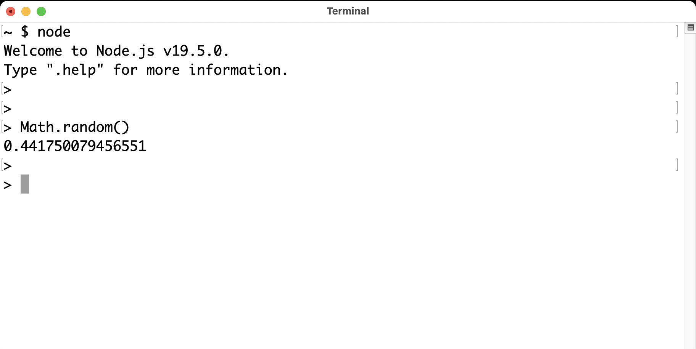
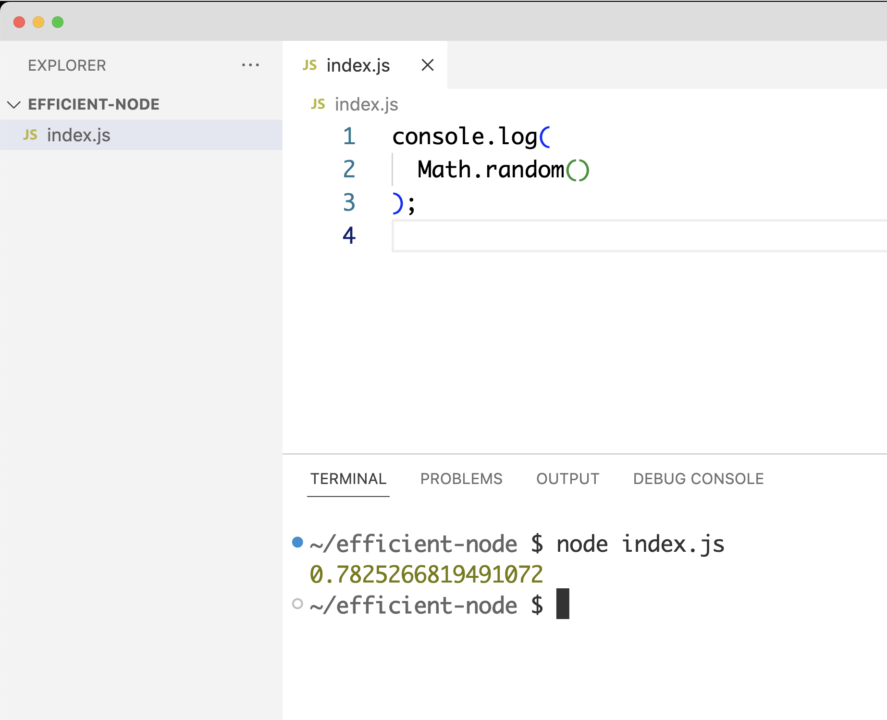

[[chapter_01]]
ifdef::env-github[]
:tip-caption: :bulb:
:note-caption: :bookmark:
:important-caption: :boom:
:caution-caption: :fire:
:warning-caption: :warning:
endif::[]

== Getting Started with Node

When it comes to learning Node, many tutorials, books, and courses tend to focus on the packages and tools available within the Node ecosystem, rather than the Node runtime itself. They prioritize teaching how to utilize popular Node libraries and frameworks, instead of starting from the native capabilities of the Node runtime.

This approach is understandable because Node is a low-level runtime. It does not offer comprehensive solutions, but rather a collection of small essential modules that makes creating solutions easier and faster. For example, a full-fledged web server will have options like serving static files (like images, css files, etc). With the Node built-in http module, you can build a web server that serves binary data, and with the Node built-in fs module, you can read the content of a file on the file system. You can combine both of these features to server static assets, using your own JavaScript code. There's no built-in Node way to serve static assets under a web server.

[NOTE]
====
Throughout the book, I use the term Node instead of Node.js for brevity. The official name of the runtime is Node.js but referring to it as just Node is a very common thing. Don't confuse that with "node" (with a lower-case n), which is the command we use to execute a Node script.
====

Popular libraries that are not part of the Node runtime (such as Express.js, Next.js, and many others with .js in their names) aim to provide nearly complete solutions within specific domains, for example, creating and running a web server (and serving static assets, and many other neat features). Practically, most developers will not be using Node on its own, so it makes sense for educational materials to focus on the comprehensive-solution packages, so learners can skip to the good parts. The common thinking here is that only developers whose job is to write these packages need to understand the underlying base layer of the Node runtime.

However, I would argue that a solid understanding of the Node runtime is essential before utilizing any of its popular packages and tools. Having a deep understanding of the Node runtime allows developers to make informed decisions when choosing which packages to use and how to use them effectively. This book is my attempt to prioritize learning the native capabilities of the Node runtime first, and then use that knowledge to efficiently utilize the powerful packages and tools in its ecosystem.

In this first chapter, I will start with an introduction to the Node runtime and why I believe it is a great option for both backend and frontend development. I'll discuss both its benefits and limitations. I will also provide instructions on how to install and set up a Node development environment, and execute a Node script. Furthermore, I will provide examples of utilizing some of the built-in modules within the Node runtime, and demonstrate how to install and use a non-built-in package as well.

=== Node Overview

Ryan Dahl started the Node runtime in 2009 after he was inspired by the performance of the V8 JavaScript engine in the Google Chrome web browser. V8 uses an event-driven model, which makes it efficient at handling concurrent connections and requests. Ryan wanted to bring this same high-performance, event-driven architecture to server-side applications. The event-driven model is the first and most important concept you need to understand about the Node runtime (and the V8 engine as well). I'll explain it briefly in this section, but we'll have a chance to talk about it a lot more in Chapter 2.

[TIP]
====
I decided to give Node a spin and learn more about it after watching the presentation Ryan Dahl gave to introduce it. I think you'll benefit by starting there as well. https://youtu.be/M-sc73Y-zQA?feature=shared[Here]. Node has changed significantly since then, so don't focus on the examples, but rather the concepts and explanations.
====

In its core, Node enables developers to use the JavaScript language on any machine without needing a web browser. Node is usually defined as “*JavaScript on backend servers*”. Before Node, that was not a common or easy thing. JavaScript was mainly a frontend thing.

However, this definition isn't really an accurate one. Node offers a lot more than executing JavaScript on servers. In fact, the execution of JavaScript is not done by Node at all. It's done with a Virtual Machine (VM) like V8 or Chakra. Node is just the coordinator. It's the one who instructs a VM like V8 to execute your JavaScript.

Node is better defined as *a server environment that wraps V8 and provides small modules that can facilitate building software applications with JavaScript*

When you write JavaScript code and execute it with Node, Node will pass your JavaScript to V8, V8 will execute that JavaScript and tell Node what the result is, and Node will make the result available to you. In addition to that, Node has a few handy built-in modules that provide easy-to-use asynchronous APIs. Let's talk about that, and a few other reasons why developers are picking Node over many other options when it comes to creating services for their backends.

[NOTE]
====
V8 is Google's open source JavaScript engine. It's written in {cpp} and used in Google Chrome and in Node. Both Chrome and Node use V8 to execute JavaScript code. V8 is the default VM in Node, but other VMs can be used with Node as well.
====

==== Node Architecture

The event-driven model in Node (which is also known as the non-blocking I/O model) is based on a *single-threaded event loop*. There's a lot to unpack about that statement but the gist is that Node can handle multiple tasks at the same time by registering an "event listener" for each task. When a task is completed, its event listener is triggered Node utilizes threads and native asynchronous capabilities of the underlying operating system to accomplish that.

The Node event loop is responsible for handling all the asynchronous I/O operations. For example, when a web client sends a request to a Node web server, Node processes the request internally without blocking the main single thread, and when it's done with the request, it picks up the request listener (which is is a special JavaScript function that's part of the web server code), and adds it to an *event queue*. The event loop is a forever ticking loop that waits for V8 single thread to be available, picks an event listener from that queue, and sends it V8 for processing.

The exact same flow happens when you instruct Node to read a file from the file system, start a timer, encrypt data, and so on. Everything has a listener function (which is also know as a callback function, because Node basically calls it back when it's ready for it). Every listener function is queued in one queue. Sometimes the queue will have multiple pending events which are all ready for processing. That's why there's a forever ticking loop, it'll pick events one by one, and in queue order (first-in, first-out).

In Chapter 2, we'll go over some code examples of how exactly this flow works with more details around the interactions between Node and V8.

==== Node Modules

Node comes with feature-rich modules that make it a great platform for hosting and managing servers. These modules offer features like reading and writing files, sending and receiving data over the network, and even compressing and encrypting data. You don't need to install these modules. They come natively packaged with Node.

The great thing about these modules is that they offer asynchronous APIs that you can use without worrying about threads (thanks to Node's event-loop). This is really why Node became very popular very quickly. You can do asynchronous programming in Node and do things in parallel without needing to deal with threads. Writing code to deal with threads is not an easy task, and Node was the escape.

The asynchronous nature of Node modules works great with VMs like V8 because these VMs are all single-threaded. This is true for both Node and web browsers. You only get a single precious thread to work with. It's extremely important to not block that thread (hence the non-blocking model). For example, in your browser, if your website blocks that single thread for, say, 2 seconds, the user cannot scroll up and down during these 2 seconds! In Node, if an incoming HTTP connection to your web server was handled synchronously rather than asynchronously, that'll block the single thread, and your whole web server cannot handle any other incoming connections while the synchronous operation is active.

Beyond the built-in modules you get with Node, Node has first-class support for {cpp} addons. You can write {cpp} code to create high-performing modules, and link them to be used directly within Node.

Node also ships with a powerful debugger and has some other handy, generic utilities that enhance the JavaScript language and provide extra APIs (for example, to create timers, work with data types, and process arrays and objects).

==== Package and Dependency Management

Node ships with a powerful package manager named npm. We did not have a package manager in the JavaScript world before Node. npm was nothing short of revolutionary. It changed the way we work and share JavaScript.

You can make a feature-rich Node application just by using code that's freely available on npm. The npm registry has hundreds of thousands of packages that you can just install and use in your Node servers. npm is a reliable package manager which comes with a simple CLI (the `npm` command). The `npm` command offers simple ways to install and maintain third-party packages, share your own code, and reuse it too.

[TIP]
====
You can install packages for Node from other package registries as well. For example, you can install them directly from GitHub.
====

Node also comes with a reliable module dependency manager (different from npm). This module dependency manager is also another thing that we did not have in the JavaScript world before Node. JavaScript today has what's known as ES modules (ES is short for ECMAScript) and Node has first class support for them. In this book, we'll see examples of both the original module dependency management in Node (named CommonJS), and the new support for ES modules.

Node's original module dependency management has been available since Node was released and it opened the door to so much flexibility in how we code JavaScript! It is widely used, even for JavaScript that gets executed in the browser, because npm has many tools to bridge the gap between modules written in Node and what browsers can work with today.

npm and Node's module systems together make a big difference when you work with any JavaScript system, not just the JavaScript that you execute on backend servers or web browsers. For example, if you have a fancy fridge monitor that happens to run on JavaScript, you can use Node and npm for the tools to package, organize, and manage dependencies, and then bundle your code, and ship it to your fridge!

The packages that you can run on Node come in all shapes and forms, some are small and dedicated to specific programming tasks, some offer tools to assist in the life cycles of an application, others help developers every day to build and maintain big and complicated applications. Here are a few example of some of my favorite ones:

- ESLint: A tool that you can include in any Node applications, and use it to find problems with your JavaScript code, and in some cases, automatically fix them. You can use ESLint to enforce best practices and consistent code style, but ESLint can help point out potential runtime bugs too. You don't ship ESLint in your production environments, it's just a tool that can help you increase the quality of your code as you write it.

- Webpack: A tool that assists with asset bundling. The *Webpack* Node package makes it very easy to bundle your multi-file frontend frameworks application into a single file for production and compile JavaScript extensions (like JSX for React) during that process. This is an example of a Node tool that you can use on its own. You do not need a Node web server to work with Webpack.

- Prettier: An opinionated code formatter tool. With Prettier, you don't have to manually indent your code, break long code into multiple lines, remember to use a consistent style for the code (for example, always use single or double quotes, always use semicolons or no semicolons). Prettier automatically takes care of all that.

- TypeScript: A tool that adds static typing and other features to the JavaScript language. It is useful because it can help developers catch errors before the code is run, making it easier to maintain and scale large codebases. TypeScript's static typing can also improve developer productivity by providing better code auto-completion and documentation in development tools.

All of these tools (and many more) enrich the experience of creating and maintaining JavaScript applications, both on the frontend and the backend. Even if you choose not to host your frontend applications on Node, you can still use Node for its tools. For example, you can host your frontend application with another framework such as Ruby on Rails and use Node to build assets for the Rails Asset Pipeline.

==== One Language Everywhere

By using Node, you're committing to the simple and flexible JavaScript language, which is used on every website today. It is a very popular programming language and despite its many historical problems, I believe JavaScript is a good language today.

With Node, you get to have a single language across the full-stack. You use JavaScript in the browser and you use it for the backend as well. There are some subtle but great benefits to that:

* One language means less syntax to keep in your head, less APIs and tools to work with, and less mistakes over all.

* One language means better integrations between your frontend code and your backend code. You can actually share code between these two sides. For example, You can build a frontend application with a JavaScript framework like React, then use Node to render the same components of that frontend application on the server and generate initial HTML views for the frontend application. This is known as server-side rendering (SSR) and it's now something that many Node packages offer out of the box.

* One language means teams can share responsibilities among different projects. Projects don't need a dedicated team for the frontend and a different team for the backend. You would also eliminate some dependencies between teams. A full-stack project can be assigned to a single team, *The JavaScript People*; they can develop APIs, they can develop web and network servers, they can develop interactive websites, and they can even develop mobile and desktop applications. Hiring JavaScript developers who can contribute to both frontend and backend applications is attractive to employers.

While Node has also played a significant role in the growing popularity of JavaScript, the language itself is simple, flexible, easy to learn, and available on every computer (client with browsers, and thanks to Node, servers as well). JavaScript is widely adopted in the programming community, particularly among beginner programmers, coding bootcamps, and startups.

=== Arguments Against Node

Node's approach to handling code in an asynchronous and non-blocking manner is a unique model of thinking and reasoning about code. If you've never done it before, it will feel weird. You need time to get your head wrapped around this model and get used to it.

Node has a relatively small standard library. This means that developers need to rely on third-party modules to perform most big tasks. There is a large amount of third-party modules available for Node. You need to do some research to pick the most appropriate and efficient ones. Many of these modules are small, which means you'll need to use multiple modules in a single project. It's not uncommon for a Node project to use hundreds of third-party modules. While this can enhance maintainability and scalability, it also requires more management and oversight. As modules are regularly updated or abandoned, it becomes necessary to closely monitor and update all modules used within a project, replacing deprecated options and ensuring that your code is not vulnerable to any of the security threats these modules might introduce.

[TIP]
Smaller code is actually why Node is named Node! In Node, we build simple small single-process building blocks (nodes) that can be organized with good networking protocols, to have them communicate with each other and scale up to build large, distributed programs.

Additionally, Node is optimized for I/O and high-level programming tasks but it may not be the best choice for CPU-bound tasks, such as image and video processing, which require a lot of computational power. Because Node is single-threaded, meaning that it can only use one core of a CPU at a time, performing tasks that require a lot of CPU processing power might lead to performance bottlenecks. JavaScript itself is not the best language for high-performance computation, as it is less performant than languages like {cpp} or Rust.

Node also has a high rate of release and version updates, this can create the need for constant maintenance and updates of the codebase, which can be a disadvantage for long-term projects.

Finally, the language you use in Node, JavaScript, has one big valid argument against it. It is a dynamically typed language, which means objects don't have explicitly declared types and they can change during runtime. This is fine for small projects but for bigger ones, the lack of strong typing can lead to errors that are difficult to detect and debug and it generally makes the code harder to reason with and to maintain.

[TIP]
The TypeScript language, which can easily be used with Node, is one popular way to mitigate the problems with dynamically-typed JavaScript. It provides a significant advantage over plain JavaScript by mitigating the weakness of weak typing and providing developers with powerful tools for creating secure, maintainable code.

=== Executing Node Scripts

If you have Node installed on your computer, you should have the commands `node` and `npm` available in a terminal. If you have these commands, make sure the Node version is a recent one (20.x or higher). You can verify by opening a terminal and running the command `node -v`.

If you don't have these commands at all, you'll need to download and install Node. You can download the latest version from the official Node website (https://nodejs.org/). The installation process is straightforward and should only take a few minutes.

For Mac users, Node can also be installed using the Homebrew package manager with the command `brew install node`.

Another option to install Node is using Node Version Manager (NVM). NVM allows you to run and switch between multiple versions of Node, it works on Mac and Linux, and there's an NVM-windows option as well.

.Node on Windows
****
All the examples I will be using in this book are Linux-based. On Windows, you need to switch the commands I use with their Windows alternatives.

I don't recommend using Node on Windows natively unless it's your only option. If you have a modern Windows machine, one option that might work a lot better for you is to install the Windows subsystem for Linux. This option will give you the best of both worlds. You'll have your Windows operating system running Linux without needing to reboot. You can even edit your code in a Windows editor, and execute it on Linux!
****

To get started, open a terminal and issue the `node` command on its own without any arguments:

----
$ node
----

[NOTE]
====
Throughout this book, I use the `$` sign to indicate a command line to be executed in a terminal. The `$` sign is not part of the command.
====

This will start a Node REPL session. REPL stands for Read, Eval, Print, Loop. It's a convenient way to quickly test simple JavaScript and Node code. You can type any JavaScript code in the REPL. For example, type `Math.random()` and then, press Enter:

Node will read your line, evaluate it, print the result, and loop over these 3 things until you exit the session (which you can do with a `CTRL+D`).

Note how the "Print" step happened automatically. We didn't need to add any instructions to print the result. Node will just print the result of each line you type. This is not the case when you execute code in a Node script. Let's do that next.

[NOTE]
====
We'll discuss Node's REPL mode (and command-line options) in detail in Chapter 2.
====

Create a new directory for the exercises of this book, and then `cd` into it:

----
$ mkdir efficient-node
$ cd efficient-node
----

Open up your editor for this directory, then create a file named `index.js`. Put the same `Math.random()` line into it:

.In index.js:
----
Math.random();
----

Now to execute that file, in the terminal, type the command:

----
node index.js
----

You'll notice that the command will basically do nothing. That's because we have not outputted anything from that file. To output something, you can use the `console` object, which is similar to the one available in browsers:

.In index.js:
----
console.log(
  Math.random()
);
----

Executing `index.js` now will output a random number

Note how in this simple example we're using both JavaScript (`Math` object), and an object from the Node API (`console`). Let's look at a more interesting example next.

[NOTE]
====
The `console` object is one of many top-level global objects that we can access in Node without needing to declare any dependencies. Node has a `global` object similar to the `window` object in browsers. The `console` object is part of the `global` object. All properties of the `global` object can be accessed directly; `console.log` instead of `global.console.log` (which also works). Other examples of global objects in Node are `process` and timer functions like `setTimeout` and `setInterval`. We'll discuss these in Chapter 2.
====

==== Examples of Using Node Built-in Modules

You can create a simple web server in Node using its built-in `http` module.

Create a `server.js` file and write the following code in there:

[subs="+quotes,+macros"]
----
const http = require('http');

const server = http.createServer((req, res) => {
  res.end('Hello World\n');
});

server.listen(3000, () => {
  console.log('Server is running...');
});
----

This is Node's version of a “Hello World” example. You don't need to install anything to run this script. This is all Node's built-in power.

When you execute this script:

----
$ node server.js
----

Node will run a web server, and you'll notice that the Node process does not exit in that case. Since the script we're executing has a "listener" that needs to run in the background.

Let's decipher this simple web server example:

The `require` function (on the first line) is what you use in Node to manage the _dependencies_ of modules. It allows a module (like `server.js`) to load and use the exports of another module (like `http`). This web server example depends on the built-in `http` module to create a web server. There are many other libraries that you can use to create a web server, but this one is built-in. You don't need to install anything to use it, but you do need to require it.

[TIP]
In a Node's REPL session, built-in modules (like `http`) are available immediately without needing to require them. This is not the case with executable scripts. You can't use modules (including built-in ones) without requiring them first.

The second line creates a server constant by invoking the `createServer` function from the `http` module. This function is one of many functions that are available under the `http` module's API. You can use it to create a web server object. It accepts an argument that is known as the _Request Listener_. The request listener is a simple function that Node will invoke every time there is an incoming connection request to the web server.

This is why this listener function receives the request object as an argument (named `req` above but you can name it whatever you want). The other argument this listener function receives, named `res` in the example, is a response object. It's the other side for a request connection. We can use the `res` object to write things back to the requester. It's exactly what our simple web server is doing. It's writing back — using the `.end` method — the _Hello World_ string.

[NOTE]
The `.end` method can be used as a shortcut to write data and then end the request in one line.

The `createServer` function only creates the server object. It does not activate it. To activate this web server, you need to invoke the `listen` method on the created server.

The `listen` method accepts many arguments, like what OS port and host to use for this server. The last argument for it is a function that will be invoked once the server is successfully running on the specified port. The example above just logs a message to indicate that the server is running successfully at that point.

While the server is running, if you go to a browser and ask for an http connection on localhost with the port that was used in the script (3000 in this case), you will see the _Hello World_ string that this example had in its request listener function.

[NOTE]
====
Both functions passed as arguments to `createServer` and `listen` are examples of events that get queued in Node's event queue and later picked up by the event loop when V8 is ready to execute them. It's easy to understand these simple examples without the complexity of how things work in the background, but when the code gets more complicated, this understanding help avoid critical errors.
====

==== Installing and Using an npm Module

Let's now look at an example of how to use an npm module in Node. Let's use the popular `lodash` module which is a JavaScript utility library with many useful methods you can run on numbers, strings, arrays, objects, and more,

First, you need to download the module. You can do that using the npm command:

----
$ npm install lodash
----

This command will download the `lodash` module from the npm registry, and then place it under a `node_modules` folder in the current directory (which it will create if it's not there already). You can verify with an `ls` command:

----
$ ls node_modules
----

You should have a folder named `lodash` in there.

Now in our Node code, we can `require` the `lodash` module to use it. For example, `lodash` has a `random` method that can generate a random number between any 2 numbers we specify for it. Here's an example of how to use it:

.In index.js
____
const _ = require("lodash");

console.log(
  _.random(1, 99)
);
____

Running this script, you'll get a random number between 1 and 99.

[TIP]
====
The `_` is common name to use for `lodash`, but you can use any name.
====

Since we called the `require` method with a non built-in module `lodash`, Node will look for it under the `node_modules` folder. Thanks to npm, it'll find it.

In a team Node project, when you make the project depend on a third-party module, you need to let other developers know of that dependency. You can do so in Node using a `package.json` file in the root of the project.

With a `package.json` file, when you `npm install` a module, the `npm` command will also list the module and its current version in `package.json`, under a `dependencies` section. When other developers pull your code, they can run the command `npm install` without any arguments, and npm will read all the dependencies from `package.json` and install them in the `node_modules` folder.

The `package.json` file also contains information about the project, including the project's name, version, description, and more. It can also be used to specify scripts that can be run from the command line to perform various tasks, like building or testing the project.

Here's an example of a `package.json` file:

.Example `package.json` file
----
{
  "name": "efficient-node",
  "version": "1.0.0",
  "description": "A comprehensive guide to learning the Node.js runtime from scratch",
  "license": "MIT"
  "scripts": {
    "start": "node index.js"
  },
  "dependencies": {
    "lodash": "^4.17.21"
  },
}
----

You can create a `package.json` file for a Node project using the `npm init` command:

----
$ npm init
----

This command will ask a few questions and you can interactively supply your answers (or press Enter to keep the defaults, which often are good because npm tries to detect what it can about the project).

[TIP]
====
You can use `npm init -y` to generate your `package.json` file with the default values (the `y` is for yes to all questions).
====

Now that the project has a `package.json` file, `npm install` a new module (for example, `express`) and see how it gets written to the `package.json` file. Then `npm uninstall` the module and see how it gets removed from `package.json`.

You can also install a module that's only needed in the development environment, but not in production. An example of that is `eslint`. To install `eslint` as a development dependency only, you add a `--save-dev` argument (or `-D` for short) to the `npm install` command.

----
$ npm install -D eslint
----

This will install `eslint` in the `node_modules` folder, and document it as a development dependency under a `devDependencies` section in `package.json`. This is where you should place things like your testing framework, your formatting tools, or anything else that you use only while developing your project.

[TIP]
====
In a production machine, development dependencies are usually ignored. The `npm install` command has a `--production` flag to make it ignore them. You can also use the `NODE_ENV` environment variable and set it to "production" before you run the `npm install` command. We'll learn more about Node environment variables in Chapter 2.
====

==== Using ES Modules

The `require` method is used by Node to implement the CommonJS module system, which is the default module system used in Node, but Node also supports the ES module system (which is part of JavaScript itself).

Let's go through another example, but this time, write it using ES modules.

To create a feature-rich web server in Node, one popular options is Express.js (available as `express` from npm). With the `express` module, you can easily handle routing, middleware, and other common web server functionalities.

You'll need to install `express` as a new dependency:

----
$ npm install express
----

This will download `express` and extract it under the `node_modules` folder, but if you take a look at what's under `node_modules` now, you'll notice that there are a lot more modules there. The `express` module depends on all these other modules, and our little example project now does too, because it depends on `express`.

Since we're going to use ES modules, we need to use the `.mjs` file extension to signal to Node that we're using the new module system.

In a `server.mjs` file, write the following code

.In server.mjs
----
import express from 'express';

const app = express();

app.get('/', (req, res) => {
  res.send('Hello Express');
});

export default app;
----

Note the use of `import`/`export` statements. This is the syntax for ES modules. You use `import` to declare a module dependency, and give its default export a name, and you can use `export` to define what other modules can use when they depend on your module.

In this example, the `server.mjs` module exports an `app` object, which we created using the `express` module, and made it able to handle connections to the root path on the server.

To use this module, just like we import express itself into `server.mjs`, we now need to `import` the `server.mjs` module itself. In an `index.mjs` file, write the following code:

----
import app from "./server.mjs";

app.listen(3000, () => {
  console.log('Server listening on http://localhost:3000');
});
----

The "./" in the import line signals to Node that this import is a relative one. Node expects to find the `server.mjs` file in the same folder where `index.mjs` is. You can also use a "../" to make Node look for the module up one level, or "../../" for two levels, and so on. Without "./" or "../", Node assumes that the module you're trying to import is either a built-in module, or a module that exists under the `node_modules` folder.

With this code, the `index.mjs` module depends on the `server.mjs` module, and uses its default export (`app`) to run the server on port 3000.

You can execute this code with:

----
$ node index.mjs
----

This will start an Express.js web server on port 3000 and log a message to the console when the server is ready. if you go to http://localhost:3000/ in the browser, you will see the _Hello Express_ string that this example had in its root path handler function.

If you want to use the `.js` extension with ES modules, you can configure Node to assume that all `.js` files are ES modules. For that, you can add a "type" property in `package.json` and give it the value of "module" (the default value for it is "commonjs"):

.In package.json
----
  "type": "module"
----

With that, ES module files can use the .js extension.

.An Analogy for Node and npm
****
Real-life analogies can sometimes help us understand coding concepts.

One of my favorite analogies about coding in general is how it can be compared to writing cooking recipes. The recipe in this analogy is the program, and the cook is the computer.

In some recipes, you can use pre-made items like a cake mix or a special sauce. And you'll most likely need to use tools, like a pan or a strainer. When compared to coding, you can think of these pre-made items and tools as the packages of code written by others which you can just download and use.

Extending on this analogy, you can think of npm as the store where you get your pre-made items to tools for your coding recipes.

But what exactly is Node's place in this analogy?

I like to think of it as the kitchen! it allows you to execute lines in your coding recipes by using built-in tools, like the stove and the sink.

Now imagine trying to cook without these built-in tools in your kitchen. That would make the task a lot harder, wouldn't it?
****

=== Summary

Node is a powerful framework for building network applications. Its event-driven, non-blocking I/O model, single-threaded event loop, and built-in module system make it easy for developers to create efficient and scalable applications.

Node wraps a VM like V8 to enable developers to execute JavaScript code in a simple way.

Node built-in modules provide easy-to-use asynchronous APIs. Node's module system allows developers to organize their code into reusable modules. These modules can be imported and used in other parts of the application.

Node has a large and active community that has created many popular modules that can be easily integrated into Node projects. These modules can be found and downloaded from the npm registry.
